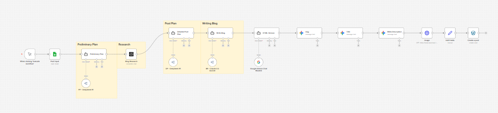

# WordPress Auto-Blogging with n8n & Multi-LLM Orchestration

An advanced n8n workflow that automates the entire content lifecycle: from SEO-driven research and planning to professional writing, styled HTML formatting, and WordPress publishing.



## 🚀 Key Features

- **Multi-LLM Pipeline**: Leverages the strengths of different models:
    - **DeepSeek R1**: Strategic planning and outlining.
    - **Perplexity AI**: Real-time research with live citations.
    - **Claude 3.5 Sonnet**: High-quality, professional B2B content writing.
    - **Google Gemini**: SEO optimization (Slug, Title, Meta Description) and HTML formatting.
- **Automated Research**: Automatically analyzes competitors and current market data.
- **SEO-First Approach**: Focuses on search intent, primary/secondary keywords, and proper HTML structure.
- **Custom Branding**: Content is automatically styled with consistent colors, fonts, and borders.
- **Media Integration**: Automatically finds and inserts relevant cover images via SerpAPI.
- **Direct Publishing**: Posts are created directly as drafts in your WordPress instance.

## 🏗️ Architecture

For a detailed breakdown of the system components and workflow stages, please refer to the [architecture.md](architecture.md) file.

## 📂 Project Structure

```text
.
├── data/           # Sample input data (CSV)
├── screenshot/     # Workflow screenshot
├── workflow/       # n8n workflow JSON file
└── architecture.md # Detailed technical architecture
```

## 🛠️ Getting Started

1.  **Import Workflow**: Import the `workflow/wordpress-auto-blogging.json` file into your n8n instance.
2.  **Configure Credentials**:
    - Google Cloud (for Google Sheets & Gemini)
    - OpenRouter (for DeepSeek & Claude)
    - Perplexity API
    - SerpAPI (for Google Image search)
    - WordPress (REST API Application Password)
3.  **Setup Google Sheet**: Create a sheet following the structure in `data/wordpress-auto-blog-sample-data.csv`.
4.  **Run**: Execute the manual trigger to start the automation.

## 📜 License

This project is licensed under the MIT License - see the [LICENSE](LICENSE) file for details (if applicable).
